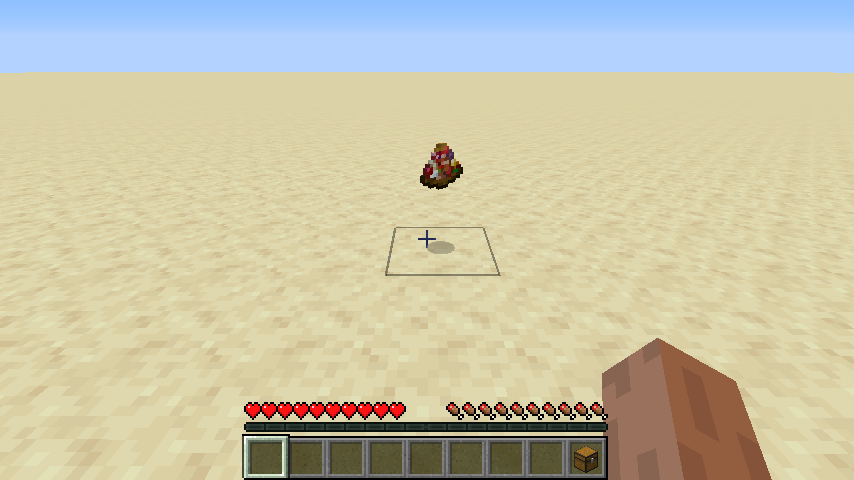

# The Last Supper

This mod adds the last supper you will ever need, albeit until you die.

The Last Supper is a special food item. Once you consume it, you will never need to consume any other food again. You will have eternally full hunger. This buff is lost when you die. Note that it will not give you infinite saturation, so it can be a trade-off.

#### Creating the Last Supper

To create your Last Supper, you will need to gather yourself the following twenty-five unique edible items:

 - Steak
 - Cooked Porkchop
 - Cooked Mutton
 - Cooked Chicken
 - Cooked Mutton
 - Cooked Rabbit
 - Rabbit Stew
 - Cooked Cod
 - Cooked Salmon
 - Pufferfish
 - Bread
 - Baked Potato
 - Golden Carrot
 - Golden Apple
 - Melon Slice
 - Beetroot Soup
 - Suspicious Stew (any kind)
 - Mushroom Stew
 - Cookie
 - Cake
 - Pumpkin Pie
 - Sweet Berry
 - Milk Bucket
 - Spider Eye
 - Chorus Fruit
 - Dried Kelp
 

You will also need a catalyst, in this case, a diamond.

The next step is to chunk all the items on the ground! Make sure all the items are within a few blocks of eachother. Then, right click the ground in the center of the pile. There will be a lightning strike, and voila! The ingredients and catalyst will be consumed, and a last supper will have appeared.

#### Configuration

Both the ingredients and the catalyst item can be completely customized via config entries.

